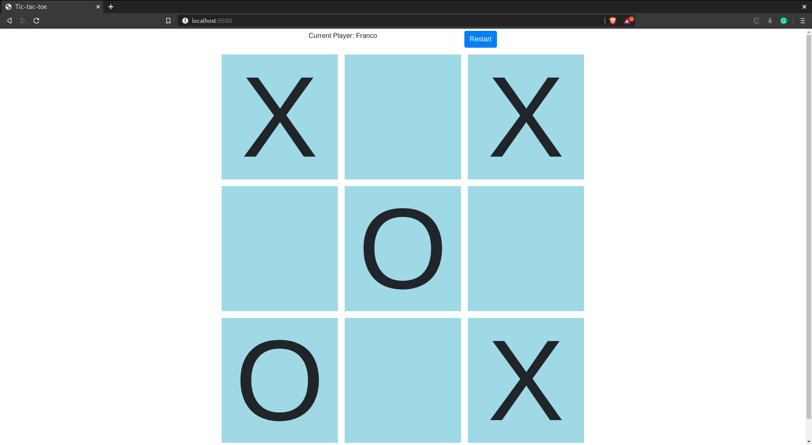

# Tic-Tac-Toe

This is a JavaScript implementation of the popular game Tic-tac-toe on a single-page application. The rendering of the game state on the document is achieved through direct DOM manipulation with JavaScript.

   
  ## Liveview
  - [Live version](https://raw.githack.com/ivanid22/tic-tac-toe/game/index.html) 
  
  ## Built With
  - JavaScript (ES6)
  - [Bootstrap](https://getbootstrap.com/) 

  ## Authors

  👤 **Ivan Diaz**

  - Github: [@ivanid22](https://github.com/ivanid22)
  - Twitter: [@ivanid22](https://twitter.com/ivanid22)
  - Linkedin: [Ivan Diaz](www.linkedin.com/in/ivanid22)

  👤 **Franco Rosa**

  - Github: [@Franco Rosa](https://github.com/FrancoRosa)
  - Linkedin: [Franco Rosa](https://www.linkedin.com/in/francoro/)

  ## 🤝 Contributing

   - Contributions, issues and feature requests are welcome!

   - Feel free to check the [issues page](https://github.com/elmejdki/TubeClone/issues).

  ## Show your support

   - Give a ⭐️ if you like this project!

  ## 📝 License

  This project is [MIT](lic.url) licensed.